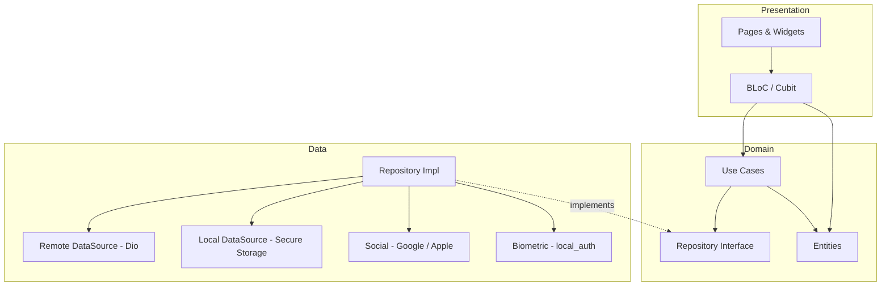
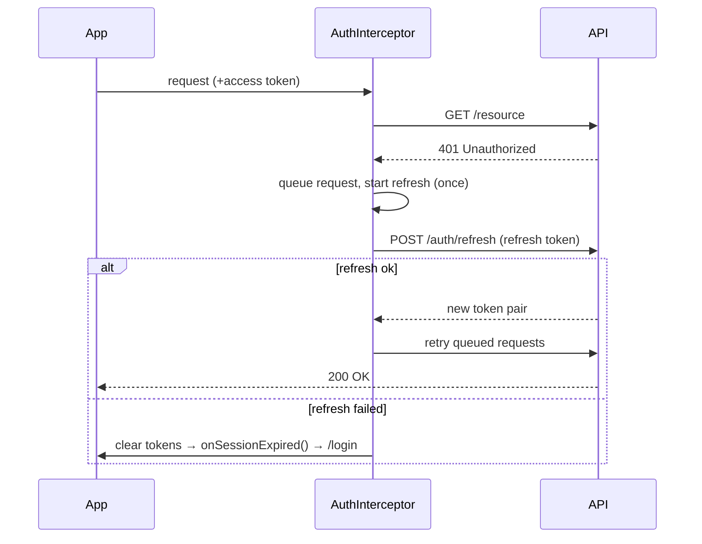

# login-system-flutter

A complete, production-grade **authentication system** for Flutter — email/password, Google & Apple sign-in, phone OTP, biometrics, JWT with silent refresh, auto-login, profile management, and onboarding — built on **Clean Architecture** with **BLoC**.

## Architecture

Three layers per feature — **data → domain → presentation** — with dependencies pointing inward. The domain layer knows nothing about Dio, Flutter, or storage.



**Token refresh flow** (handled transparently by a Dio interceptor):



---

## Features

- **Email/Password** — registration with real-time validation and a weak/medium/strong strength meter; login with Remember Me and Forgot Password.
- **Social login** — Google everywhere, Apple on iOS only; both exchange a provider token for the app's JWT pair.
- **Phone OTP** — country-code entry, 6-box auto-advancing input with paste + auto-submit, and a 60s resend countdown.
- **Biometrics** — fingerprint / Face ID unlock that silently refreshes the access token; toggle in Settings with PIN/passcode fallback.
- **JWT management** — access + refresh tokens in `flutter_secure_storage`; interceptor attaches the token, refreshes on 401, and **queues concurrent requests** during refresh.
- **Auto-login** — validates the stored refresh token on launch and routes splash → home or splash → login, with an offline cached-user fallback.
- **Profile** — edit name/phone, change avatar (gallery/camera), change password, and delete account with password confirmation.
- **Onboarding** — a 3-page intro shown once (persisted flag), with dot indicators and skip / get-started.
- **Material 3** light & dark theming, loading buttons, overlays, and responsive, keyboard-aware layouts.

---

## Project Structure

```
lib/
├── app/            app.dart, routes.dart (go_router + guards), theme.dart
├── core/
│   ├── constants/  api & app constants
│   ├── errors/     failures, exceptions
│   ├── network/    dio_client, interceptors (refresh + queue), api_response
│   ├── storage/    secure_storage, local_storage
│   └── utils/      Result<T> (Either-style)
├── di/             service_locator.dart (get_it manual wiring)
├── features/
│   ├── auth/       data / domain / presentation
│   ├── onboarding/
│   └── profile/    data / domain / presentation
└── shared/         reusable widgets
test/               unit / widget / integration
```

---

## Setup

```bash
flutter pub get

# Run against your backend (compile-time define)
flutter run --dart-define=API_BASE_URL=https://api.example.com/v1
```

### Environment

Configuration is passed via `--dart-define` (see [`.env.example`](.env.example) for the full list). The key one:

| Variable       | Purpose                          | Default                          |
| -------------- | -------------------------------- | -------------------------------- |
| `API_BASE_URL` | Backend base URL                 | `https://api.example.com/v1`     |

### Google / Apple Sign-In

- **Google:** add your OAuth client IDs to `android/app/google-services.json` and the iOS `Info.plist` URL scheme (`REVERSED_CLIENT_ID`).
- **Apple:** enable "Sign in with Apple" capability in Xcode; configure your Service ID for Android/web if needed.

### Deep links (password reset & email verification)

Register the `loginsystem://auth` scheme (Android intent filter / iOS associated domains). The router maps `…/reset-password?token=…` to the reset screen.

---

## Backend API Contract

The app expects a REST backend with these endpoints (JSON `{ data, message, success }`):

`POST /auth/register` · `POST /auth/login` · `POST /auth/refresh` · `POST /auth/logout` · `POST /auth/oauth/google` · `POST /auth/oauth/apple` · `POST /auth/otp/send` · `POST /auth/otp/verify` · `POST /auth/forgot-password` · `POST /auth/reset-password` · `GET/PUT /profile` · `POST /profile/avatar` · `POST /auth/change-password` · `DELETE /profile`

Auth endpoints return `{ user, tokens: { accessToken, refreshToken } }`.

---

## Testing

```bash
flutter test               # all unit + widget + flow tests
flutter test --coverage    # with coverage
```

- **Unit:** formz input validation, `LoginCubit`, `AuthBloc` (with a hand-written `FakeAuthRepository` — no mock codegen).
- **Widget:** OTP auto-submit & paste, password-strength meter, login-form real-time validation.
- **Flow:** login → global `AuthBloc` authenticated → logout, device-free.

---

## A note on code generation

The reference spec mentions `freezed`, `json_serializable`, and `injectable`. Those tools require a `build_runner` codegen step, and their generated files (`*.freezed.dart`, `*.g.dart`, `*.config.dart`) are not committed. To keep this repository **buildable with a single `flutter pub get`** (no codegen), the same Clean Architecture is implemented with:

- hand-written immutable models (`Equatable` + explicit `fromJson`/`toJson`),
- `get_it` wired manually in [`service_locator.dart`](lib/di/service_locator.dart),
- `formz` for form inputs (runtime, no codegen),
- a small `Result<T>` type instead of `dartz`.

The layering, contracts, and testability are identical; only the boilerplate source is authored by hand rather than generated.

---

## License

MIT
